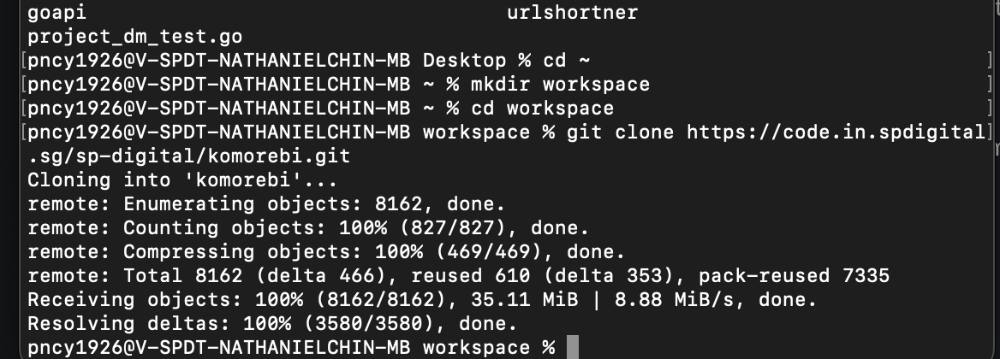
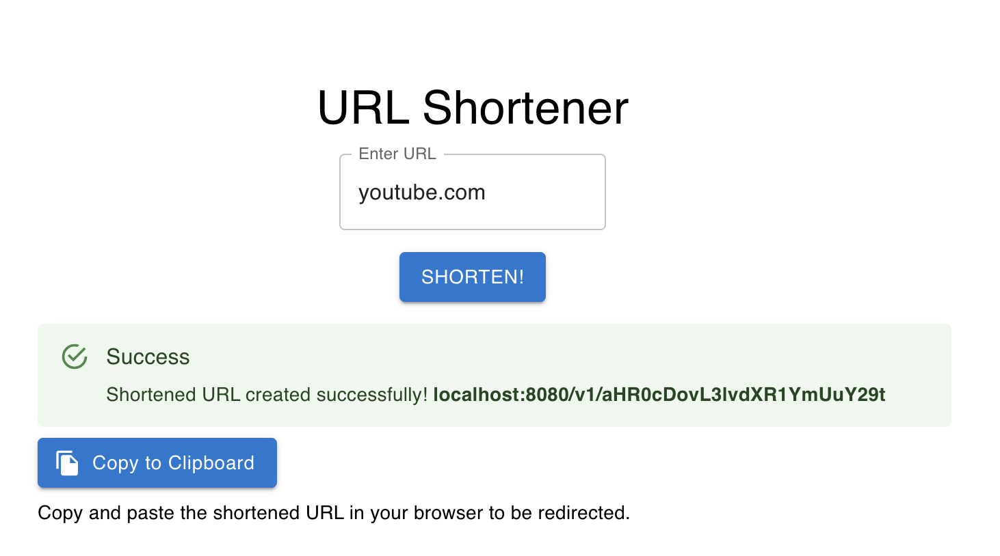
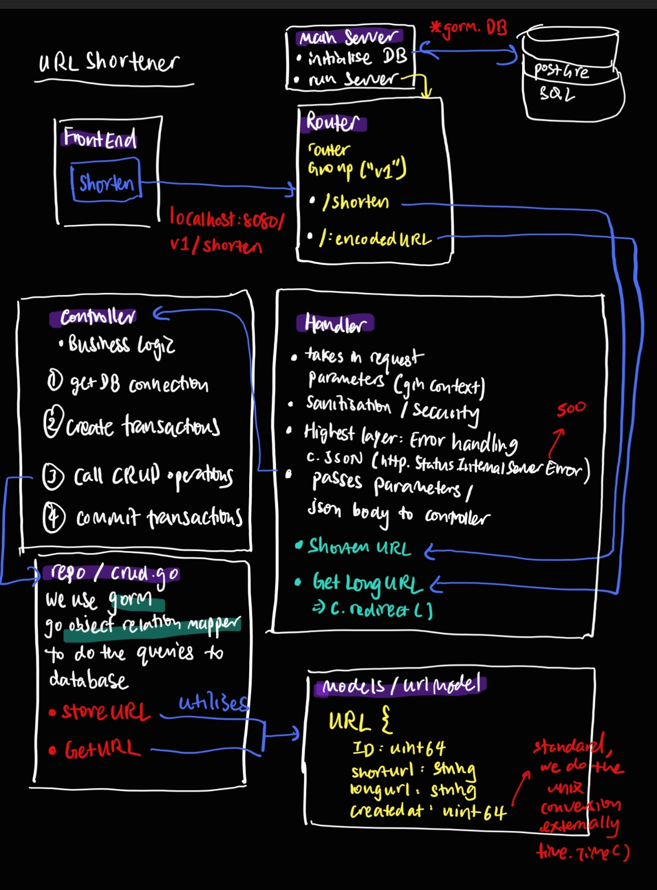

## cloning a repo
### download github cli
for mac download github cli
```bash
brew install gh
```

try to clone into a workspace folder from the root user directory

then for api, npm start
for web and admin uis, npm run dev

### now in the repos
```
cd api or admin or web
npm run
### to see which commands you can run
npm install
npm run dev or npm start

### if npm runs into error
sudo npm install -g yarn
yarn install
```


### download github cli

## git flow cheatsheet
init is the master branch
when developing features, create a branch named "feature/featurename"
hotfixes are branches that merge direct into production
https://danielkummer.github.io/git-flow-cheatsheet/

## commands to run the server/api
```bash
go get .
go run .
```

OR 

```bash
go get .
go build
./urlshortener
```
### for running more than 1 file
go run main.go server.go
do note go run main.go will not work as it does not see server.go as part of the same package

## commands to run the frontend
```
cd frontend
npm install
npm start  
```


## curl commands to test api
### Create a shortened url
```bash
curl http://localhost:8080/v1/shorten \
    --include \
    --header "Content-Type: application/json" \
    --request "POST" \
    --data '{"longurl": "www.google.com"}'
```

```bash
curl http://localhost:8080/v1/shorten \
    --include \
    --header "Content-Type: application/json" \
    --request "POST" \
    --data '{"longurl": "twitter.com"}'
```

```bash
curl http://localhost:8080/v1/shorten \
    --include \
    --header "Content-Type: application/json" \
    --request "POST" \
    --data '{"longurl": "falsetest not url"}'
```

### Retrieve a long url
- do note here we include the `-i` tag to see the Location headers to see if the redirect works
```bash
curl http://localhost:8080/v1/<insert shortened url>
curl -i http://localhost:8080/v1/aHR0cDovL3d3dy5nb29nbGUuY29t
```


## sql query to make schema
```sql
CREATE TABLE urls (
    id SERIAL PRIMARY KEY,
    shorturl VARCHAR(255) UNIQUE NOT NULL,
    longurl TEXT NOT NULL,
    createdat BIGINT DEFAULT EXTRACT(EPOCH FROM CURRENT_TIMESTAMP)::BIGINT
);
```

```sql
SELECT * FROM public.urls
ORDER BY id ASC 
```


## sql query to index shorturl
since we need to often search for clashes in shorturl
```sql
-- Index for the shorturl column to speed up retrieval
CREATE INDEX idx_shorturl ON urls (shorturl);
```

## Architecture


## notes on the http codes
404 means the route is not found
200 is a successful http request e.g. if you send a post
500 means exception in the program
302 server is responding with an HTTP Found status code, instructing the client to redirect to the specified longURL.

## notes to import packages within same module
go under go.mod to see your module name
then you can import any of your packages via:
<modulename>/<relative-filepath-from-module-root>

## vs code shortcuts
cmd+P opens the file search bar
cmd+shift+P oepns the vscode command bar, for installing packages etc
cmd+shift+L edits the same words at the same time

## create react project
```
npx create-react-app url-shortener-frontend
cd url-shortener-frontend
```

## notes on singleton principle for the use of db connection object
https://refactoring.guru/design-patterns/singleton

## expiration of old data
Use a cron job
We store a createdAt field. After 30 days, any entries will be deleted.
Our background goroutine will run a cleanup every 24 hours.

## context
ctx has a session scope and is immutable
it is passed through the function call stack
used for tracing purposes => look into go jaegar
used also for testing => you can add params into it, where functions can check the ctx for these params, then execute specific functions


## unit testing design
always start with bottom layer of the code for testing
=> e.g. repo layer

start with valid cases
invalid:
- missing parameter
- invalid parameter
- internal errors

### test driven development
means you start with the functional requirements, then write functions to test first
once you are done with writing the test functions
then you start implementing the code with the functionality
tests are written before the implementation

### write a test suite:
https://medium.com/nerd-for-tech/testing-rest-api-in-go-with-testify-and-mockery-c31ea2cc88f9
=> initialisation before running tests
testify suite
the setupSuite (one file) runs before the whole group of tests
setupTest is run before each test
teardownSuite
teardownTest

### Freeze time for time testing:
possibility, have a global time, e.g. globalTime := time.now()
then in your code use the globalTime
except in your tests, you change globalTime to something else, this freezes time.
OR
can use frameworks like clockwork

### File Labelling:
every file will have the same name + "_test"

## Mocking in Testing
Mocking Frameworks:
- gomock or mockery

### Purpose of mocking
Mocking is not as useful in the case of testing a repo layer as you have control over
creating the struct for your models

Instead,
Purpose of mocking:
E.g controller function calls a CRUD function

This CRUD function may return varying results if I use its actual implementation, which could then affect the tests of my controller function.
As such I mock this CRUD function to give me a specific result that I want (.EXPECT) so that it provides a fixed environment that allows me to run tests for my controller


### When to use a real testDB connection for testing VS mocking the database?
We want a DB for us to run our test cases

#### Mock DB
Some deployment pipelines may require all test cases to pass in the deployment pipeline itself, the pipeline itself may also not support connecting to the DB
Although a possible solution to the above problem is to have a docker server run the DB in the pipeline which you can then connect to, but this will make the pipeline heavy
as such in such situations you use a mock DB for your test cases

#### Using Real DB
However if the culture of the team is such that you do testing and ensure all test cases pass before pushing to production, then in such a scenario you can use a real DB e.g. called testDB, testing locally before pushing

### Mockgen
mockgen is used in gomock to generate mocks
https://github.com/golang/mock#installation
- go install github.com/golang/mock/mockgen@v1.6.0
- nano ~/.zshrc
then paste:
- export PATH=$PATH:/Users/pncy1926/go/bin
- my username is pncy1926

#### Creating mocks with mock gen
Lets say we want to mock our repo layer functions, crud.go 
This is because we want to do testing in our controller layer which depends on the repo layer
1. At the root of our folder project urlshortener, where our main.go file is:
2. mockgen -source=repo/urlrepo/crud.go -destination=repo/urlrepo/mocks/crud_mock.go
- note: the source is the file we want to mock
3. These generated mock interfaces are just empty shells, you will have to use EXPECT() on it:
```go
(1) Define an interface that you wish to mock.
      type MyInterface interface {
        SomeMethod(x int64, y string)
      }
(2) Use mockgen to generate a mock from the interface.
(3) Use the mock in a test:
      func TestMyThing(t *testing.T) {
        mockCtrl := gomock.NewController(t)
        defer mockCtrl.Finish()

        mockObj := something.NewMockMyInterface(mockCtrl)
        mockObj.EXPECT().SomeMethod(4, "blah")
        // pass mockObj to a real object and play with it.
      }
```
4. run the tests
```bash
# both current directory and all subdirectories
go test ./...
```

## Why should context not be in struct?
- This is to retain flexibility
- the example below shows that if ctx is part of struct, then we will have to instantiate 2 different objects, repo twice just to insert data into A and B
```go
func CtrlA(ctx context.Context) error {

	repo := NewRepo(ctx=1000)
	repo.InsertDataA(dataA)

    repo := NewRepo(ctx=2000)
	repo.UpdateDataB(dataB)

	return nil
}

```

- However, if we leave context to be passed into the function calls, look at the added flexibility!:
```go
func CtrlA(ctx context.Context) error {

	repo := NewRepo()
	ctxA := context.WithTImout(contex.Background, 1000)
	repo.InsertDataA(ctx, dataA)

	ctxB := context.WithTImout(contex.Background, 5000)
	repo.UpdateDataB(ctx, dataB)

	return nil
}

```

- However, there are exceptions, look at my TestSuites for example, there I used context in struct, and that is because I want a baseline context that contains a context key for my DB, this is so that before every test runs, it can just duplicate this context and add on to it easily.

```go

type controllersTestSuite struct {
	suite.Suite                                    // embed the suite package
	controllers controllers.URLControllerInterface // embed the repo which contains the methods to test
	db          *gorm.DB                           // test database instance
	clock       clockwork.Clock                    // mock clock for freezing time
	ctx context.Context
}

// Run before each test
func (s *controllersTestSuite) SetupTest() {
	// set up fresh context before each test
	s.ctx = context.Background()
	s.db = common.GetDBTest()
	// and add the test db into the context
	s.ctx = context.WithValue(s.ctx, config.CtxKeyDB, s.db)
	s.controllers = controllers.NewURLController()
	// Truncate all tables in the database
	if err := utils.TruncateTables(s.db); err != nil {
		s.T().Fatal(err)
	}
}
```
